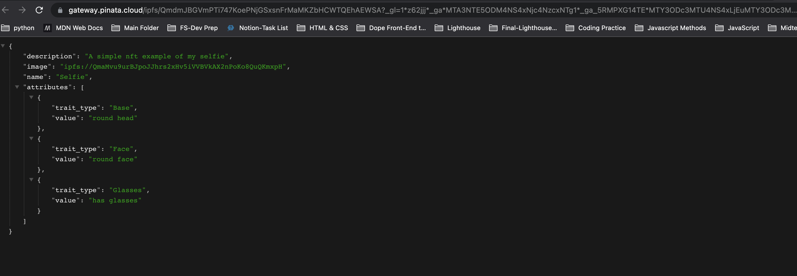

# Web3 Decentralized App in Ethereum

    This is a pradctice project for building a NFT minting app with Ethers.js. You need to connect to your metamask wallet with either your chrome extension or mobile app and then click the mint button to finish the transaction. It utilized React as frontend frame work and connects to backend using ethers.js. For the backend I wrote smart contracts with Solidity and complie them with Hardhat. For Image uploading and storage I used IPFS and Pinata as they provide an easier and safer way to store files into a decentralized system.

## [Link](https://github.com/Benjamin0203/Obsidian-Sync-Notes/blob/main/00_Important%20Notes/Blockchain.md)

# Set up

1. Download meatamask extension
2. cd `./frontend` then `npm i`
3. cd `./hardhat-backend` then `npm i`
4. inside `/frontend` run `npm start` to start the server on `localhost: 3000`

# Showcase

# Techstack

- Ethers.js
- Hardhat
- IPFS (InterPlanetary File System)
- Pinata
- Typescript
- Solidity
- React
